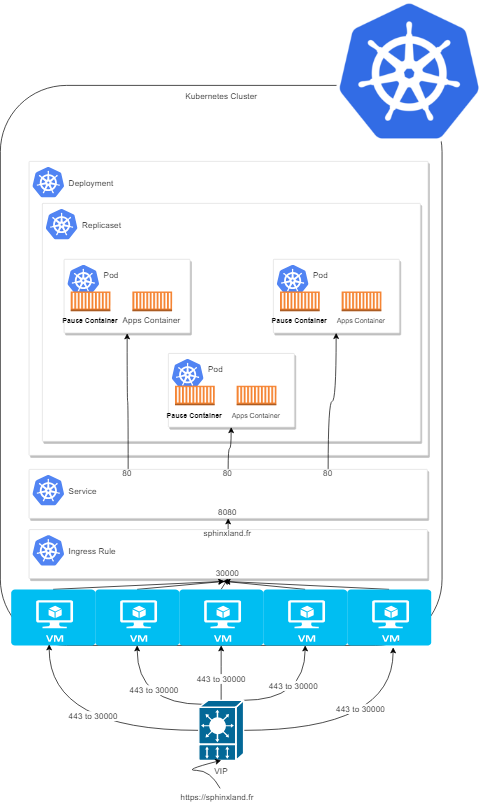

## Kubernetes' Basics Objects

Components are systems services or containers that provide  the cluster’s control and data plane.

Objects are declarations stored in **etcd** to defined apps and other process to obtain cluster's functional services.

### Application Objects :

**Pod :** Minimal object in cluster. It's a set of 1 ort more containers excluding `pause container` which support network.

**Replicaset :** Number of replicas (pods) that app needs.

**Deployment :** Deployment definition in the cluster. (node placement, replicas, affinity & antifinity, labels )

**Service :** A Kubernetes Service is an abstraction which defines a logical set of Pods and a policy by which to access them.

**Ingress Rule :** Ingress, added in Kubernetes v1.1, exposes HTTP and HTTPS routes from outside the cluster to services within the cluster. Traffic routing is controlled by rules defined on the Ingress resource.

### Other Objects

Kubernetes is composed of many objects that make its learning curve difficult however the following list represents the first above objects needed to survive in this eco-system.

**Namespace :** Pseudo Environment can be defined as private collection of objects. All objects in this env are not visible from other namespace. All apps could be resolved with short name.

**Secrets/ConfigMaps :** Base64 encoded data stored in etcd to be injected when the container is instantiated

**PersistemVolume / PersistemVolumeClaim :** Mounted process for data in Container and external endpoints

**NetworkPolicies (optionnal) :** Kubernetes Network Plugin firewall rules.

---

Full list : [Kubernetes.io](https://kubernetes.io/docs/concepts/)